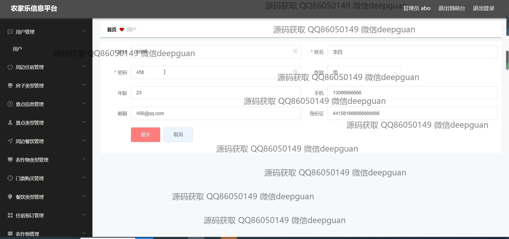
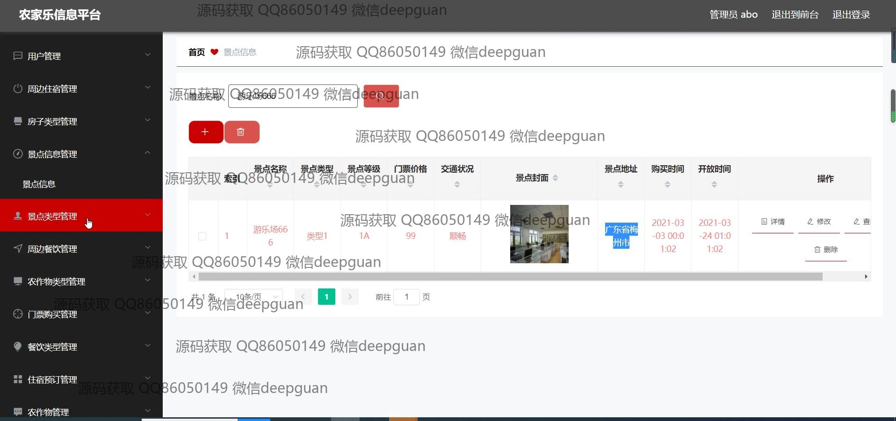
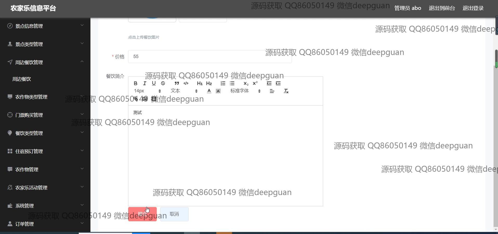
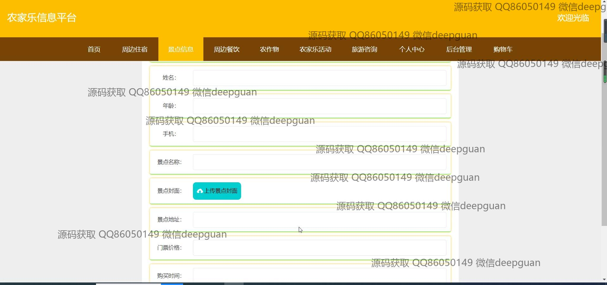

<h1 align="center">农家乐信息平台的设计与实现+vue</h1>

## 简介
农家乐信息平台：角色分为管理员、用户；功能包括用户管理、住宿预订、景点信息、餐饮展示、活动管理。界面简洁直观，提供高效的农家乐相关信息管理与查询服务。    --计算机毕业设计源码；毕设源码；java毕业设计源码

## 联系方式

<h3 align="center">获取完整代码与数据库文件 + 微信：deepguan QQ: 86050149 QQ群: 783742310</h3>

<h3 align="center">可帮忙远程部署 包运行成功！提供远程部署、修改代码、设计文档指导、代码讲解等服务！</h3>

## 功能介绍（完整见运行截图）
管理员：管理用户账户，包括用户信息的添加、编辑和删除，用户权限设置。负责系统后台的维护，包含周边住宿、景点信息、房子类型、周边餐饮、农作物和农家乐活动的增删改查。 管理和配置网站主页、导航栏、页面布局和内容。处理订单管理，包括生成、更新和删除用户订单信息。提供详细的活动编辑，包含上传插图、设定人数和活动介绍。

用户：账户注册、登录和管理，包括个人信息修改及密码重置。浏览和搜索网站主页的文章及推荐内容，查看详细的景点和住宿信息。 从平台获取旅游、住宿和餐饮的推荐，并可预定和支付相关服务。个人中心管理，包括管理订单、收藏和地址信息。 带优化的用户界面体验，用户通过搜索和过滤快速查找所需内容。

## 运行截图

本代码来源于网络,仅供学习参考使用!

